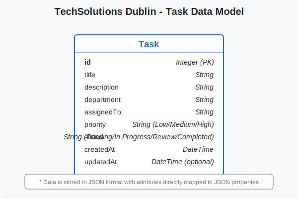

# TechSolutions Dublin - Task Management System


A comprehensive Task Management System for TechSolutions Dublin, a technology consulting company based in Dublin, Ireland. This system allows for the management of tasks across different departments with full CRUD functionality.

## 📋 Table of Contents

- [TechSolutions Dublin - Task Management System](#techsolutions-dublin---task-management-system)
  - [📋 Table of Contents](#-table-of-contents)
  - [✨ Features](#-features)
  - [🛠️ Technology Stack](#️-technology-stack)
  - [🏗️ System Architecture](#️-system-architecture)
  - [🌐 API Endpoints](#-api-endpoints)
  - [💾 Database Structure](#-database-structure)
  - [🔧 Installation](#-installation)
  - [🧪 Testing](#-testing)
  - [🚀 Usage](#-usage)
  - [📁 Project Structure](#-project-structure)
  - [Diagrams](#diagrams)
    - [Data Flow Diagram](#data-flow-diagram)
    - [er Diagram](#er-diagram)
    - [system architecture](#system-architecture)

## ✨ Features

- **Create, Read, Update, Delete (CRUD)** operations for tasks
- **Filter tasks** by department, staff member, and status
- **Responsive design** for desktop and mobile devices
- **Interactive UI** with Bootstrap styling and animations
- **RESTful API** for task management
- **JSON-based data storage** for simplicity and portability
- **Unit and integration tests** for reliable functionality

## 🛠️ Technology Stack

- **Frontend**:
  - HTML5, CSS3, JavaScript
  - Bootstrap 5 for responsive design
  - Bootstrap Icons for iconography

- **Backend**:
  - Python 3.11
  - Flask framework for API and routing
  - Gunicorn for production server

- **Data Storage**:
  - JSON files for data persistence

- **Testing**:
  - Python's unittest framework

## 🏗️ System Architecture

The application follows a client-server architecture with a RESTful API:

```
Client (Browser) <--> Flask Server <--> JSON Data Storage
```

1. **Client-side**: The frontend is built with HTML, CSS, and JavaScript, handling user interactions and making API calls to the backend.

2. **Server-side**: The Flask server processes API requests, performs CRUD operations on tasks, and serves the web application.

3. **Data Storage**: Task data is stored in JSON files, providing a simple but effective data persistence mechanism.

## 🌐 API Endpoints

| Endpoint | Method | Description | Parameters |
|----------|--------|-------------|------------|
| `/api/tasks` | GET | Get all tasks | Optional: `department`, `staff`, `status` for filtering |
| `/api/tasks` | POST | Create a new task | Required: task data (title, description, etc.) |
| `/api/tasks/<id>` | GET | Get a specific task | Task ID |
| `/api/tasks/<id>` | PUT | Update a task | Task ID, Updated task data |
| `/api/tasks/<id>` | DELETE | Delete a task | Task ID |
| `/api/departments` | GET | Get unique departments | None |
| `/api/staff` | GET | Get unique staff members | None |
| `/api/statuses` | GET | Get unique statuses | None |

## 💾 Database Structure

Tasks are stored in JSON format with the following structure:

```json
{
  "id": 1,
  "title": "Task Title",
  "description": "Task Description",
  "department": "Department Name",
  "assignedTo": "Staff Member Name",
  "priority": "High/Medium/Low",
  "status": "Pending/In Progress/Review/Completed",
  "createdAt": "ISO datetime",
  "updatedAt": "ISO datetime (optional)"
}
```

## 🔧 Installation

1. Clone the repository:
   ```bash
   git clone https://github.com/hariAD2898/B9IS123-TMD3
   cd techsolutions-dublin-tms
   ```

2. Install dependencies:
   ```bash
   pip install -r requirements.txt
   ```

3. Run the application:
   ```bash
   python main.py
   ```
   or for production:
   ```bash
   gunicorn --bind 0.0.0.0:5000 --reuse-port --reload main:app
   ```

4. Access the application at `http://localhost:5000`

## 🧪 Testing

To run the tests:

```bash
python -m unittest discover tests
```

The test suite includes:
- Unit tests for API functionality
- Integration tests for end-to-end workflows

## 🚀 Usage

1. **View Tasks**: The main page displays all tasks with filtering options
2. **Create Task**: Click "Add New Task" to create a new task
3. **Edit Task**: Click the "Edit" button on any task to update it
4. **Delete Task**: Click the "Delete" button to remove a task
5. **Filter Tasks**: Use the filter section to filter tasks by department, staff member, or status

## 📁 Project Structure

```
techsolutions-dublin-tms/
├── app.py             # Main Flask application
├── main.py            # Entry point
├── data/              # Data storage
│   └── tasks.json     # Tasks data
├── static/            # Static files
│   ├── css/           # CSS styles
│   │   └── custom.css
│   └── js/            # JavaScript files
│       ├── main.js
│       └── tasks.js
├── templates/         # HTML templates
│   └── index.html
├── tests/             # Test files
│   ├── test_api.py
│   └── test_integration.py
├── requirements.txt   # Dependencies
└── README.md          # This file
```

##  Diagrams
### Data Flow Diagram


### er Diagram


### system architecture

